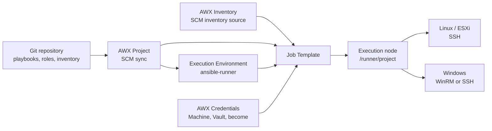

# Public Ansible AWX demo

This repository is an automatically generated, sanitized demonstration of the
private Ansible management project. It is intended for learning Ansible CLI
and AWX integration patterns, not for managing real systems.

The inventory uses documentation-only 192.0.2.0/24 addresses and .example
names. It contains no production hosts, Vault files, passwords, private keys,
scan output, or confidential infrastructure data.

## Start here

    python3 -m venv .venv
    source .venv/bin/activate
    python -m pip install -r requirements.txt -r requirements-dev.txt
    ansible-galaxy collection install -r requirements.yml
    ansible-inventory --graph
    ansible-playbook playbooks/common/asset_report.yml -l managed_nodes

Use a private inventory and AWX Credentials before connecting to real hosts.
The public repository intentionally cannot reach or authenticate to the demo
addresses.

The complete guides are included below for a single-page reference and are
also kept as separate Markdown files for direct linking and maintenance.

- AWX integration guide: awx.md
- Inventory guide: inventory.md
- Playbooks and usage: playbooks.md
- Roles: roles/README.md

## AWX integration guide

This document describes how to integrate this repository with AWX while
keeping the Ansible CLI workflow working. The repository is designed around a
Git-controlled project, a static YAML inventory, reusable roles, explicit
platform targeting, and credentials injected by AWX at job launch.

### 1. Architecture



AWX does not run Ansible from the administrator's WSL session. A job runs in
an AWX execution environment on an execution node. The execution node must
have network reachability to the managed hosts, the required collections and
Python libraries, and the credentials supplied to the job.

The repository contributes content and configuration. AWX contributes runtime
selection, secrets, RBAC, scheduling, logging, and execution placement.

### 2. Repository contract

The important integration points are:

| Repository item | AWX use |
|---|---|
| `ansible.cfg` | Default inventory, role path, SSH behavior, and Ansible defaults |
| `inventory/production/hosts.yml` | SCM inventory source path |
| `inventory/production/group_vars/` | Site, platform, and shared variables |
| `playbooks/` | Job Template playbook choices |
| `roles/` | Roles available through `roles_path` |
| `requirements.yml` | Required Ansible collections for the execution environment |
| `requirements.txt` | Local control-node dependencies and EE Python dependency reference |
| `.github/workflows/ansible-ci.yml` | Pre-merge and post-commit quality gates |
| `vault/site_a.yml`, `vault/site_b.yml` | Encrypted site variables loaded explicitly by selected playbooks |

The repository's standard inventory is configured as:

```ini
[defaults]
inventory = ./inventory/production/hosts.yml
roles_path = ./roles
```

AWX normally runs with `/runner/project` as the project working directory, so
the relative paths resolve when the Project content is present. For maximum
predictability, select the inventory explicitly in the AWX Inventory and keep
the Job Template tied to the same Project revision.

### 3. Create the AWX Project

In AWX, create a Project with:

| Field | Recommended value |
|---|---|
| Name | `ansible-management` |
| Organization | The owning organization |
| Source Control Type | Git |
| Source Control URL | The repository's HTTPS or SSH clone URL |
| Source Control Branch/Tag | `main`, or a controlled release branch/tag |
| Source Control Credential | Only if the repository is private |
| Update Revision on Launch | Enabled for development; use controlled syncs for production |
| Cache Timeout | Short enough for required updates, long enough to avoid unnecessary syncs |

Use a deploy key or a GitHub App/token with read-only repository access for a
private project. Do not place a Git token in a playbook, survey, inventory, or
extra variable.

After saving, run **Sync** and confirm the project revision. A successful
Project sync proves that AWX received the repository; it does not prove that
the execution environment can reach any managed host.

### 4. Build or select the Execution Environment

An Execution Environment (EE) is the container image used as the Ansible
control node for a job. It must contain the Ansible version, collections, and
Python libraries used by this repository.

This repository currently declares:

```yaml
# requirements.yml
ansible.windows==3.7.0
community.windows==3.3.0
chocolatey.chocolatey==1.6.0
```

and Python dependencies including:

```text
ansible-core==2.19.13
pywinrm==0.5.0
```

For production, build and pin a custom EE rather than relying on a mutable
`latest` image. The EE should include:

1. The pinned collections from `requirements.yml`.
2. `pywinrm` for Windows WinRM connections.
3. Kerberos dependencies only when Kerberos is actually used.
4. The same Ansible core major/minor version tested by CI.
5. Any system packages required by scripts or lookup plugins.

Select the pinned EE in every production Job Template. Updating an EE should
be a versioned change tested against the repository before rollout.

### 5. Create and sync the AWX Inventory

Create an AWX Inventory, then add an **Inventory Source** with:

| Field | Value |
|---|---|
| Source | Project |
| Project | The project created above |
| Inventory file | `inventory/production/hosts.yml` |
| Update on Launch | Enabled when inventory changes must be picked up automatically |
| Cache timeout | Appropriate for the operational change rate |

Run **Update** and verify the expected `all`, `sites`, `managed_nodes`,
`platform`, `services`, and deferred/status groups.

The inventory deliberately separates dimensions:

- `sites` describes location.
- `managed_nodes` is the normal operational scope and contains all four sites.
- `platform` contains `linux`, `windows`, `esxi`, and `macos` branches.
- `linux` contains the distribution groups, and `redhat` contains version groups.
- `services` describes roles such as `truenas`, `nfs_servers`, and hypervisors.
- `observations`, `nonssh`, and `ansible_unreachable` are excluded from normal
  managed scope.

Use intersections in playbooks and Limits, for example:

```text
managed_nodes:&site_b:&windows
managed_nodes:&linux
managed_nodes:&site_c
```

Do not create a second manually maintained AWX inventory that duplicates this
SCM inventory unless there is a clear ownership boundary. Duplicate inventory
definitions are a common source of stale connection variables.

### 6. Credentials and secret flow

#### Machine credentials

Create the appropriate AWX Machine credential for the target transport:

- Linux and ESXi SSH: username, SSH private key, and optional become settings.
- Windows WinRM: username and password, with inventory selecting
  `ansible_connection: winrm` and the WinRM port/transport.
- Windows OpenSSH: username and SSH private key, with inventory selecting
  `ansible_connection: ssh` and the Windows SSH shell settings.

The credential is injected into the job's isolated runtime. AWX does not
inherit the SSH key from `/root/.ssh/`, a developer's Windows profile, or a
separate WSL session.

#### Vault credentials

The site Vault files are intentionally outside `inventory/production/group_vars`:

```text
vault/site_a.yml
vault/site_b.yml
```

The Windows plays that need them load them explicitly with play-level
`vars_files`. The encrypted files contain their own Vault ID labels. Create one
AWX Vault credential per label, using the exact matching Vault ID, and attach
the required credentials to the Job Template:

| Credential | Purpose |
|---|---|
| `machine-linux` | SSH key and Linux account |
| `machine-windows` | WinRM or Windows SSH account |
| `vault-site-a` | Decrypts `vault/site_a.yml` |
| `vault-site-b` | Decrypts `vault/site_b.yml` |
| Machine become settings | Privilege escalation when required |

For jobs that can parse or target both sites, attach both Vault credentials.
For a site-scoped job, attach at least the Vault credential required by every
playbook play AWX will parse. Never pass a Vault password through a survey or
`extra_vars`.

An AWX SCM inventory source cannot be expected to decrypt arbitrary Vault files
without a credential. Keeping encrypted files out of `group_vars` prevents an
inventory synchronization failure such as:

```text
ERROR! Attempting to decrypt but no vault secrets found
```

The Vault credential belongs on the Job Template or Workflow node, while the
playbook owns the explicit file path. This keeps inventory import independent
of runtime secret access.

#### Secret-handling rules

- Never commit plaintext passwords, private keys, tokens, or Vault password files.
- Do not put secrets in surveys, defaults, hostnames, comments, or debug output.
- Use `no_log: true` around tasks that may process sensitive values.
- Do not print `ansible-inventory --list` output when secret variables are loaded.
- Rotate any credential that was exposed, even if the containing commit is later
  deleted.
- Limit credential visibility by organization, team, and Job Template RBAC.

### 7. Job Template design

Create separate Job Templates for different risk and credential boundaries.
Recommended initial templates are:

| Job Template | Playbook | Limit | Mode |
|---|---|---|---|
| Connectivity | `playbooks/common/connectivity.yml` | Required at launch | Read-only |
| Asset report | `playbooks/common/asset_report.yml` | `managed_nodes` or site | Read-only |
| SSH access audit | `playbooks/common/ssh_access_audit.yml` | Site/platform | Read-only |
| Linux baseline | `playbooks/common/baseline.yml` | `managed_nodes:&linux` | Controlled change |
| Linux updates | `playbooks/linux/update_linux.yml` | Small canary first | Controlled change |
| Windows baseline | `playbooks/common/baseline.yml` | `managed_nodes:&windows` | Controlled change |
| Exposed Ubuntu hardening | `playbooks/linux/exposed_ubuntu_hardening.yml` | One node first | High risk, opt-in |

Configure each template with:

- Project and inventory from the same environment.
- A pinned Execution Environment.
- The minimum required Machine and Vault credentials.
- A required Limit for change-oriented jobs.
- A reasonable fork/concurrency limit.
- Job slicing only when the playbook is safe to parallelize.
- Verbosity normally `0`; increase it temporarily for troubleshooting.
- Notifications for failure, approval, and completion as appropriate.
- A timeout that prevents a stuck job from running indefinitely.

Use Workflows when a process has stages, for example:

```text
connectivity -> read-only audit -> approval -> canary update -> wider update
```

Do not make a production update template silently reboot all hosts. Reboot
should be a separate approval-controlled stage or require an explicit variable
such as `confirm_reboot=true`.

### 8. Surveys and extra variables

Surveys are appropriate for safe operational choices, not secret storage. Good
survey fields include:

```text
limit                  site or host pattern
apply_changes          boolean, default false
apply_updates          boolean, default false
confirm_reboot         boolean, default false
patch_serial           integer with a safe maximum
```

Use the template's Limit field for target selection when possible. Validate
survey choices and avoid exposing arbitrary module arguments. Extra vars have
high precedence, so an unrestricted survey can override inventory and role
defaults unexpectedly.

### 9. Transport implementation in this repository

#### Linux and ESXi

Linux plays use intersections such as:

```yaml
hosts: "managed_nodes:&linux"
```

The default SSH user is configured in `ansible.cfg` and inventory variables,
but the AWX Machine credential should be the authoritative source for the
private key. Linux change playbooks that use `become: true` require a credential
with privilege escalation configured.

#### Windows WinRM

Windows groups define the connection plugin and transport settings in
`inventory/production/group_vars/`:

```yaml
ansible_connection: winrm
ansible_port: 5985
ansible_winrm_transport: ntlm
```

The effective user and password must come from the AWX Machine credential or a
private Vault variable. A WinRM port combined with `ansible_connection: ssh`
causes errors such as “Connection closed ... port 5985.” After changing group
variables, sync the Project and update the AWX Inventory before rerunning the
Job Template.

#### Windows OpenSSH

OpenSSH is a separate transport. Use `ansible_connection: ssh`, the SSH port,
the appropriate `ansible_shell_type`, and a Machine credential containing the
private key. Do not attach an SSH key and expect it to authenticate a WinRM
connection.

### 10. CLI and AWX parity

The CLI equivalent of an AWX job should be reproducible from the repository
root:

```bash
ansible-inventory --graph
ansible managed_nodes --list-hosts
ansible-playbook playbooks/common/connectivity.yml -l site_b \
  --vault-id site_a@prompt --vault-id site_b@prompt
ansible-playbook playbooks/common/asset_report.yml -l managed_nodes
ansible-playbook playbooks/linux/update_linux.yml \
  -l 'managed_nodes:&linux' --check
```

In AWX, translate these options as follows:

| CLI option | AWX setting |
|---|---|
| `-i` | Inventory selection |
| Playbook path | Job Template Playbook |
| `-l` | Job Template Limit or survey field |
| `--vault-id` | Attached Vault credential with matching ID |
| `--ask-become-pass` | Machine credential privilege escalation settings |
| `-e name=value` | Template extra vars or validated survey field |
| `--check` | Check-mode option or a dedicated check template |
| `--tags` / `--skip-tags` | Job Template Options fields |

Do not put shell command-line options into the playbook path. For example,
`demo_b_redhat9` after the playbook name is interpreted as another playbook; use `-l demo_b_redhat9`
for a host limit.

### 11. CI and release workflow

The repository workflow should pass before an AWX Project sync is promoted:

1. Pull request review.
2. YAML and inventory validation.
3. Playbook syntax checks.
4. Safe role smoke tests.
5. Target-resolution checks.
6. YAML and Ansible lint.
7. Secret scanning.
8. Merge to the controlled branch.
9. AWX Project sync and inventory update.
10. Read-only connectivity/audit job.
11. Approval-controlled change workflow.

Pin collection, Python, Ansible, and EE versions. Test the exact EE image used
by production AWX; a local WSL installation is not an equivalent runtime.

### 12. RBAC and operating model

Use separate AWX teams or roles for project/inventory administrators, credential
administrators, read-only auditors, operators who can launch change jobs, and
production approvers.

Grant users access to Job Templates instead of broad credential access when
possible. Keep production and lab inventories separate, restrict who can edit
surveys and extra vars, and record changes through Git and AWX activity logs.

For high-impact roles, use a dedicated template with a narrow Limit, serial
execution, approval, and an explicit opt-in variable. The
`exposed_ubuntu_hardening` role is an example of this pattern.

### 13. Publishing a sanitized public snapshot

The repository includes `.github/workflows/publish-awx-demo.yml` for publishing
the current source snapshot to a separate public repository. Its default target
is `andyxuan2010/ansible-awx-demo`; a workflow-dispatch input can override the
target repository.

The workflow has two jobs:

1. `build-and-validate` checks out the source, runs
   `scripts/publish_awx_demo.py`, generates normalized demo inventory and
   documentation, scans for Vault/key/private-network data, and runs inventory,
   syntax, YAML-lint, and Ansible-lint checks.
2. `publish` waits on the `public-demo-publish` protected environment, then
   creates the destination repository if needed and pushes the sanitized
   snapshot to its `main` branch.

The generated snapshot excludes `old/`, `vault/`, production inventory and
group variables, bootstrap scripts, source-specific documentation, and the
publisher workflow itself. It uses documentation-only addresses and generic
aliases. The source repository remains the system of record; the public repo
is a generated artifact and should not be edited manually.

#### One-time GitHub configuration

1. Create the public destination repository, or allow the workflow token to
   create it.
2. Add a repository secret named `AWX_DEMO_REPO_TOKEN`. Use a GitHub App or a
   fine-grained token with only the permissions needed to create/update the
   destination repository. Do not use a personal credential in workflow YAML.
3. Create the `public-demo-publish` Environment and configure required
   reviewers. The build job runs first; the publish job pauses for approval.
4. Optionally define the repository variable `AWX_DEMO_REPO` to override the
   default target. A manual workflow run can also supply `target_repo`.
5. Push to `main` or run the workflow manually. Review the build artifact before
   approving publication.

The sanitizer is a defense-in-depth control, not a substitute for review. Add
new exclusion or normalization rules whenever a new secret-bearing file,
private endpoint format, or environment-specific naming convention is added.

### 14. Troubleshooting checklist

#### Inventory update fails with a Vault error

Check that encrypted files are not under `inventory/production/group_vars`.
The inventory source must parse without a Vault credential. Put the files in
`vault/`, load them with play-level `vars_files`, attach matching Vault
credentials to the Job Template, and resync the inventory.

#### Linux reports `Permission denied (publickey)`

Confirm the AWX Machine credential contains the correct private key and user.
Validate from the AWX execution node or a matching EE, not only from WSL. Check
that the Job Template actually has the credential attached and that a stale
inventory variable is not overriding `ansible_user` or `ansible_host`.

#### Windows reports a connection closed on port 5985

Inspect the resolved inventory variables and confirm:

```yaml
ansible_connection: winrm
ansible_port: 5985
```

Then verify that the Windows Machine credential supplies the account and
password, the execution node can reach the port, and the Project/Inventory
were resynchronized after the variable change.

#### Collection or module is unavailable

Inspect the selected EE. Install the pinned collections from `requirements.yml`
inside the EE and select that image in the Job Template. Project sync alone is
not a substitute for building the runtime dependencies.

#### A playbook targets zero hosts

Run `ansible-inventory --graph` locally and inspect the AWX Inventory Hosts and
Groups pages. Check spelling and intersections such as
`managed_nodes:&linux`. A host may be in a site group but outside
`managed_nodes`, `windows`, or `linux`.

### 15. Production readiness checklist

- [ ] Project points to the intended repository, branch, and revision.
- [ ] Inventory source is `inventory/production/hosts.yml`.
- [ ] Inventory update succeeds without decrypting Vault files.
- [ ] The selected EE is pinned and contains all collections and Python libs.
- [ ] Execution nodes can reach SSH, WinRM, DNS, and any required proxy path.
- [ ] Machine credentials are attached and scoped correctly.
- [ ] Required Vault credentials are attached to the Job Template or Workflow.
- [ ] No passwords or private keys are in Git, surveys, or extra vars.
- [ ] Connectivity and read-only audit jobs pass first.
- [ ] Change jobs require a deliberate Limit and safe defaults.
- [ ] Reboots and hardening jobs have approval or a separate controlled stage.
- [ ] AWX RBAC and notifications are configured.
- [ ] CI passed for the exact commit and EE used for the launch.

### References

- [AWX job templates](https://ansible.readthedocs.io/projects/awx/en/24.6.1/userguide/job_templates.html)
- [AWX credentials](https://ansible.readthedocs.io/projects/awx/en/24.6.1/userguide/credentials.html)
- [AWX execution environments](https://ansible.readthedocs.io/projects/awx/en/24.6.1/userguide/execution_environments.html)
- [AWX SCM inventory sources](https://ansible.readthedocs.io/projects/awx/en/24.6.1/administration/scm-inv-source.html)
- [AWX multiple credential assignment](https://ansible.readthedocs.io/projects/awx/en/24.6.1/administration/multi-creds-assignment.html)
- [Ansible inventory guide](https://docs.ansible.com/projects/ansible/latest/inventory_guide/intro_inventory.html)
- [Ansible Runner project and inventory layout](https://ansible.readthedocs.io/projects/runner/en/stable/intro.html)

## Inventory guide

This inventory is a normalized template. It uses documentation-only addresses
and generic aliases; replace it in a private project before operational use.

The hierarchy separates location (sites), operational scope (managed_nodes),
platform (linux, windows, esxi, macos), services, hardware, and deferred/status
groups. A host can belong to several dimensions. Use intersections such as
managed_nodes:&site_b:&windows when selecting a platform within a site.

Duplicate endpoint aliases demonstrate a shared node_id. Ansible still treats
each alias as a separate host, so avoid targeting both aliases for a change
unless that is intentional.

    ansible-inventory --graph
    python scripts/validate_inventory.py

## Playbooks and usage

The public snapshot contains current cross-platform, Linux, Windows, and role
examples from the source repository. Change-oriented jobs should use a
deliberate Limit, check mode where supported, and AWX credentials.

### Common playbooks

| Playbook | Purpose |
|---|---|
| admin_group_audit.yml | Common Linux/Windows example |
| asset_report.yml | Common Linux/Windows example |
| baseline.yml | Common Linux/Windows example |
| config_backup.yml | Common Linux/Windows example |
| connectivity.yml | Common Linux/Windows example |
| directory.yml | Common Linux/Windows example |
| disk_usage.yml | Common Linux/Windows example |
| dns_lookup.yml | Common Linux/Windows example |
| ensure_service.yml | Common Linux/Windows example |
| environment.yml | Common Linux/Windows example |
| file_checksum.yml | Common Linux/Windows example |
| filesystem_health.yml | Common Linux/Windows example |
| firewall_status.yml | Common Linux/Windows example |
| http_check.yml | Common Linux/Windows example |
| identity.yml | Common Linux/Windows example |
| install_common_tools.yml | Common Linux/Windows example |
| installed_software.yml | Common Linux/Windows example |
| listening_ports.yml | Common Linux/Windows example |
| local_accounts.yml | Common Linux/Windows example |
| log_summary.yml | Common Linux/Windows example |
| management_marker.yml | Common Linux/Windows example |
| mounts.yml | Common Linux/Windows example |
| network_config.yml | Common Linux/Windows example |
| package_cache.yml | Common Linux/Windows example |
| patch_systems.yml | Common Linux/Windows example |
| pending_updates.yml | Common Linux/Windows example |
| port_check.yml | Common Linux/Windows example |
| process_control.yml | Common Linux/Windows example |
| process_summary.yml | Common Linux/Windows example |
| reboot_required.yml | Common Linux/Windows example |
| reboot_systems.yml | Common Linux/Windows example |
| resource_usage.yml | Common Linux/Windows example |
| route_table.yml | Common Linux/Windows example |
| runtime.yml | Common Linux/Windows example |
| scheduled_task.yml | Common Linux/Windows example |
| scheduled_task_status.yml | Common Linux/Windows example |
| security_status.yml | Common Linux/Windows example |
| service_inventory.yml | Common Linux/Windows example |
| service_status.yml | Common Linux/Windows example |
| shares.yml | Common Linux/Windows example |
| ssh_access_audit.yml | Common Linux/Windows example |
| system_facts.yml | Common Linux/Windows example |
| temp_cleanup.yml | Common Linux/Windows example |
| time_sync.yml | Common Linux/Windows example |
| timezone.yml | Common Linux/Windows example |
| uptime.yml | Common Linux/Windows example |

Example commands:

    ansible-playbook playbooks/common/connectivity.yml -l managed_nodes
    ansible-playbook playbooks/common/asset_report.yml -l managed_nodes
    ansible-playbook playbooks/common/baseline.yml -l managed_nodes:&linux --check

See awx.md for Project, inventory, Execution Environment, credential, Vault,
Job Template, and Workflow integration guidance.

## Roles

Roles are reusable implementation units loaded from the repository's
`roles_path`. The playbook selects the target hosts and role variables; the
role owns its tasks, templates, defaults, and metadata.

| Role | Purpose | Used by |
|---|---|---|
| `baseline` | Linux management marker and optional baseline packages | `playbooks/common/baseline.yml`, `playbooks/linux/site.yml` |
| `linux_automation_baseline` | Installs Linux baseline packages and creates `/opt/automation` | `playbooks/common/baseline.yml` |
| `windows_management_marker` | Creates the Windows management marker | `playbooks/common/baseline.yml` |
| `awx_demo_report` | Read-only execution-context report for demonstrations | `playbooks/examples/role_demo.yml` |
| `exposed_ubuntu_hardening` | Opt-in UFW, Fail2ban, unattended-upgrades, and SSH hardening for demo-ubuntu-02/demo-ubuntu-01 | `playbooks/linux/exposed_ubuntu_hardening.yml` |
| `common_asset_report` | Read-only normalized asset metadata for Linux and Windows | `playbooks/common/asset_report.yml` |
| `linux_package_cache` | Opt-in package-cache refresh and cleanup for Linux | `playbooks/common/package_cache.yml` |
| `windows_update_audit` | Read-only Windows hotfix audit | Custom Windows maintenance play |

### Role conventions

- Put safe, reusable defaults in `defaults/main.yml`.
- Keep implementation in `tasks/main.yml`; use templates for generated files.
- Add `meta/main.yml` with the supported Ansible version and dependencies.
- Keep site- and host-specific values in inventory variables or AWX surveys.
- Change-oriented roles should expose an explicit opt-in variable or be used
  only by a playbook that clearly represents the change.
- Do not store passwords, private keys, or vault passphrases in a role.

### Safe role example

Run the read-only demo role from WSL:

```bash
ansible-playbook playbooks/examples/role_demo.yml -l site_b
```

In AWX, create a job template using the project and production inventory,
attach the appropriate Machine credential, and use the Limit field for the
site or host. The demo role does not modify managed hosts.

### Exposed Ubuntu hardening

`exposed_ubuntu_hardening` is deliberately disabled by default. It is scoped
to the Ubuntu aliases for demo-ubuntu-02 and demo-ubuntu-01 and their wireless SSH aliases. Use
the playbook's limit to pilot one physical node first, then explicitly set
`exposed_ubuntu_hardening_apply=true`. Review the SSH and firewall settings
before enabling it in production; password authentication is not disabled by
default to reduce lockout risk.

### Additional roles

`common_asset_report` and `windows_update_audit` are read-only reporting roles.
`linux_package_cache` is opt-in and does nothing unless its update or cleanup
variable is explicitly enabled. Keep change-oriented roles behind a deliberate
limit and review them in check mode first.
